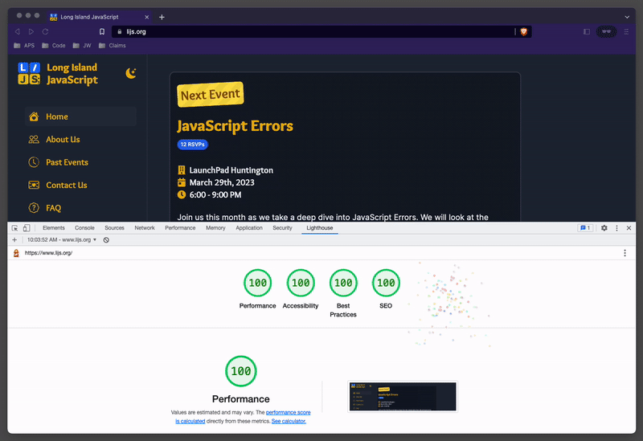

[](https://www.lijs.org)

# [www.lijs.org](www.lijs.org)

## The official website of the Long Island JavaScript Meetup group.

Built with [Next.js](https://nextjs.org/) and [TailwindCSS](https://tailwindcss.com/). Deployed on [Vercel](https://vercel.com/).




## Getting Started

Clone the repo:
```bash
git clone git@github.com:longislandjavascript/www.lijs.org.git
```

Install the dependencies:
```bash
npm install
```

Start the development server:
```bash
npm run dev
```

Open [http://localhost:3000](http://localhost:3000) in your browser.

